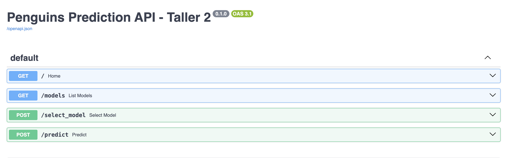
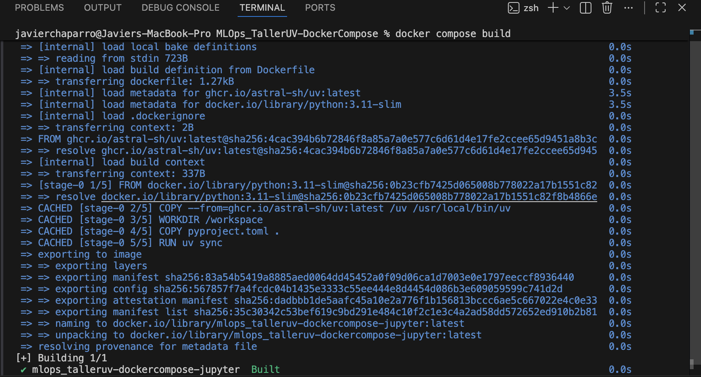
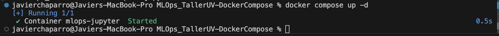
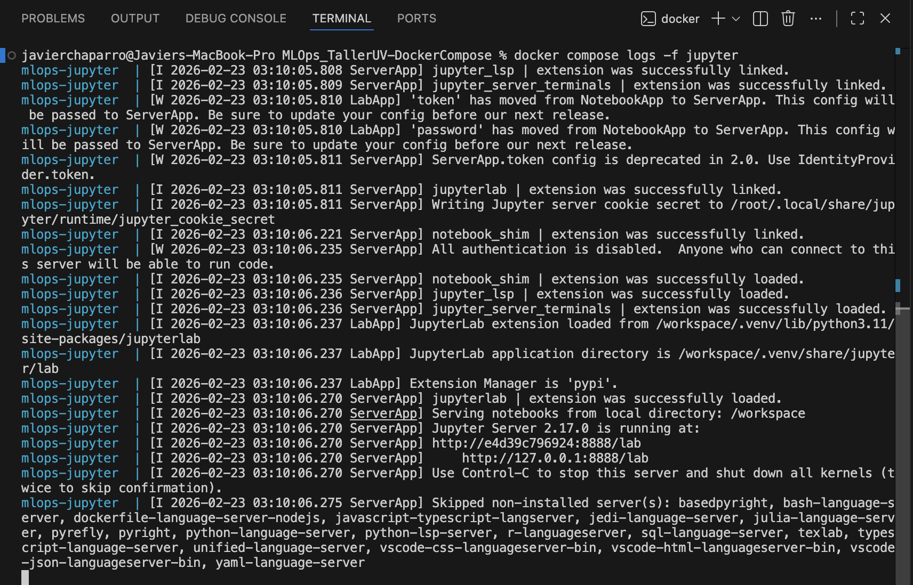
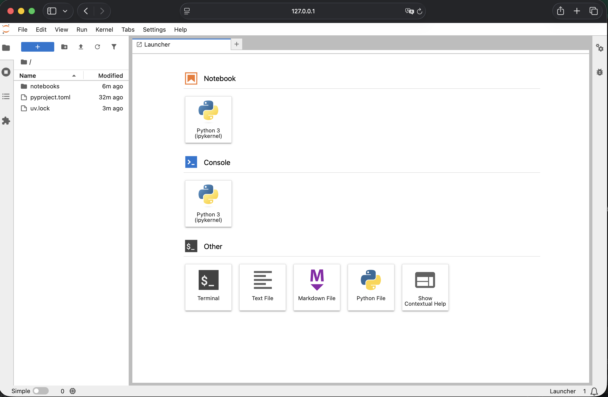
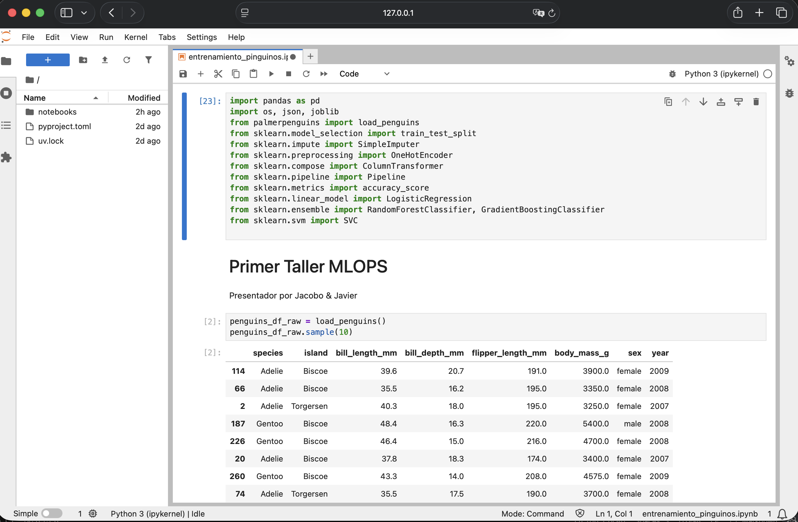
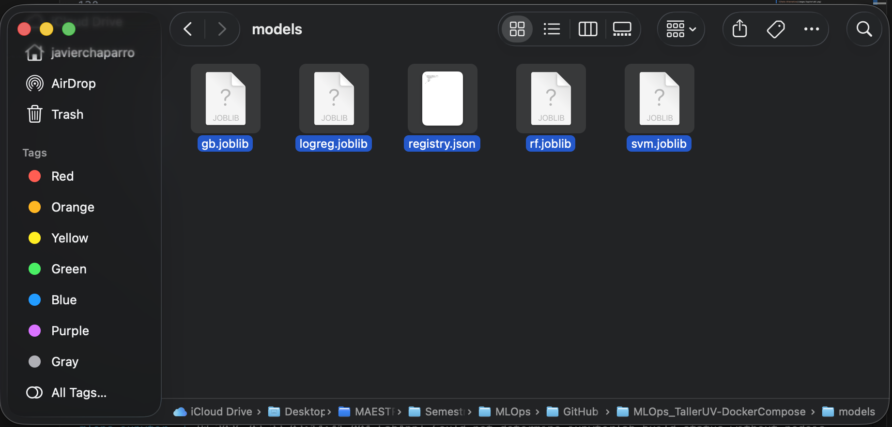
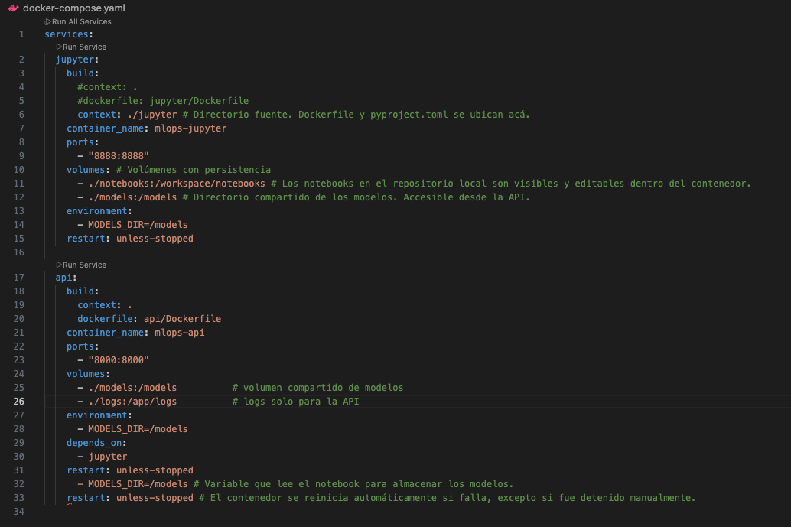

# Penguins Species Classification API – MLOps Taller 2 - Desarrollo de Contenedores
# Presentado Por
- Jacobo Orozco Ardila
- Javier Chaparro

## Descripción

Este proyecto implementa un flujo completo de Machine Learning utilizando el dataset Palmer Penguins.  
Se desarrolla el entrenamiento de múltiples modelos y posteriormente se expone un servicio de inferencia mediante FastAPI, el cual es contenerizado usando Docker.

El objetivo principal de este taller es construir entorno de desarrollo con Docker Compose y JupyterLab e integrarlo con UV.

---

## Estructura del Proyecto

```
Repo/
├── docker-compose.yml
├── pyproject.toml
├── uv.lock
│
├── api/
│ ├── Dockerfile
│ └── penguin_predict/
│ └── main.py
│
├── jupyter/
│ └── Dockerfile
│
├── models/ # directorio compartido entre Jupyter y API
│ ├── *.joblib
│ └── registry.json
│
├── notebooks/
│ └── entrenamiento_pinguinos.ipynb
│
└── logs/
└── predictions.log
```

---

## Dataset

Se utiliza la librería `palmerpenguins` para descargar los datos.

El problema consiste en predecir la especie del pingüino:

- Adelie
- Gentoo
- Chinstrap

---

## Proceso de Entrenamiento

El entrenamiento se realiza en el notebook `entrenamiento_pinguinos.ipynb`.

Etapas principales:

1. Carga de datos
2. Separación en variables X y Y
3. División en entrenamiento y validación
4. Definición de pipelines:
   - Imputación para variables numéricas
   - Imputación + OneHotEncoding para variables categóricas
5. Entrenamiento de múltiples modelos
6. Evaluación básica con accuracy
7. Serialización de modelos usando `joblib`
8. Creación de `registry.json` con:
   - Modelo por defecto
   - Modelos disponibles

---

## API – FastAPI

La API permite:

- Consultar el estado del servicio
- Listar modelos disponibles
- Seleccionar el modelo activo
- Realizar predicciones



### Endpoints disponibles

GET `/`  
Retorna estado del servicio y modelo activo.

GET `/models`  
Lista modelos disponibles y modelo activo.

POST `/select_model`  
Permite cambiar el modelo activo.

POST `/predict`  
Recibe las características de un pingüino y retorna la predicción.

---

## Archivos de Docker Compose y JupyterLab + UV
1. Dockerfile de JupyterLab: /jupyter/Dockerfile
2. Definir dependencias con UV: /jupyter/pyproject.toml
3. Docker Compose: ./docker-compose.yaml  

Líneas de ejecución

# Construir la imagen
docker compose build --no-cache



# Levantar el servicio (container)
docker compose up



# Ver logs (opcional)
docker compose logs -f jupyter



# Acceder a JupyterLab a través de la URL: http://127.0.0.1:8888/lab



Dentro del JupyterLab ingresar al directorio "notebooks" y ejecutar el notebook "entrenamiento_pinguinos.ipynb".



Los modelos quedarán almacenados en el directorio compartido "models".



---

# API 
- Construido desde `api/Dockerfile`
- Utiliza el mismo `pyproject.toml` y `uv.lock`
- Expone el puerto `8000`
- Consume modelos desde el volumen compartido `models/`
- Escribe logs en `logs/predictions.log`

## Volúmenes Compartidos

Docker Compose define volúmenes que permiten comunicación indirecta entre servicios:

- `./models:/models` → permite que la API consuma modelos entrenados en Jupyter.
- `./logs:/app/logs` → permite persistir logs generados por la API.



---

## Entorno Unificado con UV

Se definió un único archivo:

- `pyproject.toml`
- `uv.lock`

Ubicados en la raíz del proyecto.

Esto garantiza que:

- El servicio de entrenamiento (Jupyter)
- El servicio de inferencia (API)

Utilicen exactamente las mismas versiones de dependencias y la misma versión de Python.

Se utiliza:

```bash
uv sync --frozen --no-dev